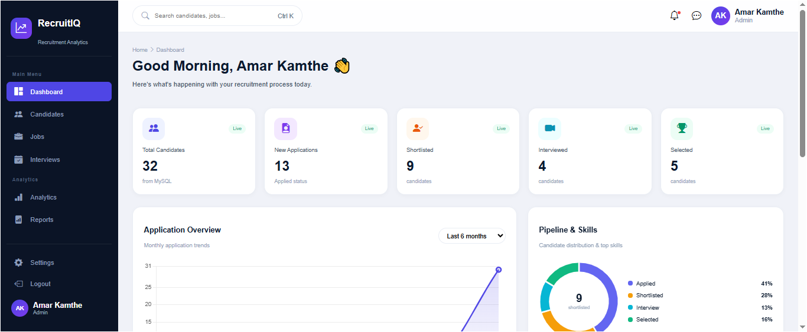
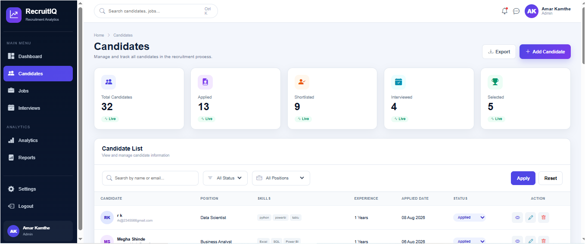
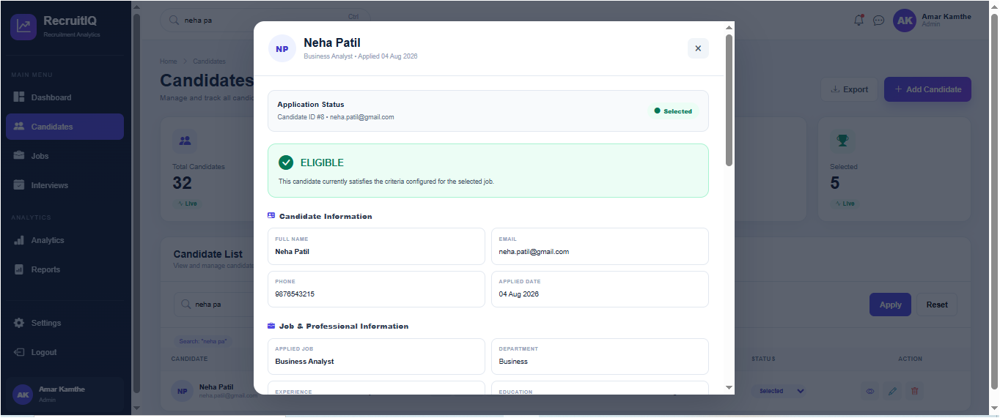
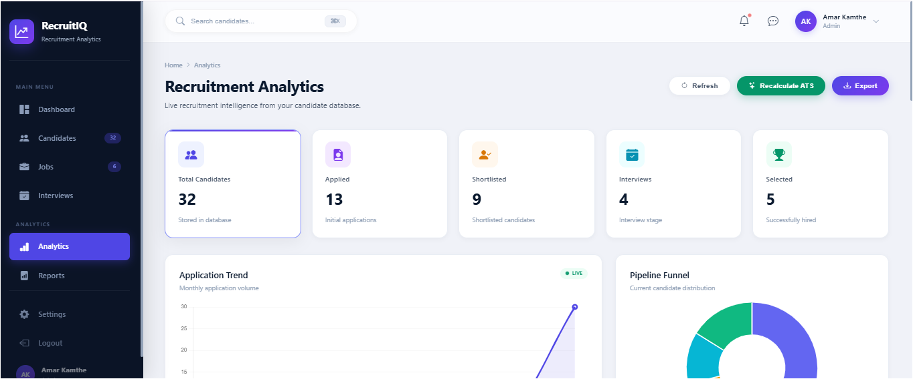
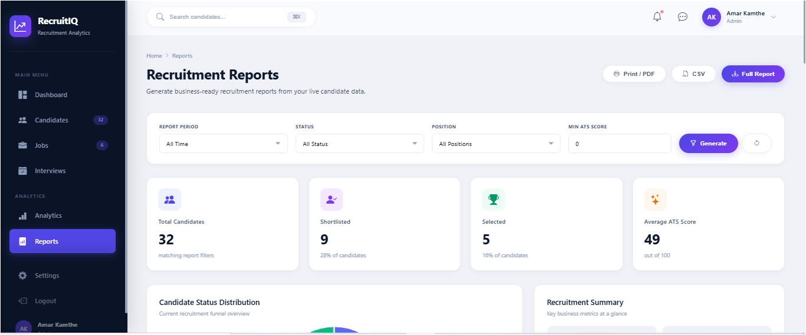

# RecruitIQ - Smart Recruitment Analytics Platform

RecruitIQ is a web-based Smart Recruitment Analytics Platform designed to help recruiters manage candidates, job openings, interviews and recruitment analytics from a centralized system.

The platform provides candidate management, job management, ATS-based candidate evaluation, recruitment criteria checking, interview scheduling, analytics and reporting functionality.

---

## 1. Project Overview

RecruitIQ helps recruiters manage the recruitment lifecycle through a centralized web application.

The system allows recruiters to:

- Manage candidates
- Create and manage job openings
- Calculate and view ATS scores
- Evaluate candidates against job criteria
- Schedule and manage interviews
- Track candidate recruitment status
- View recruitment analytics
- Generate recruitment reports
- Export report data to CSV
- Print reports or save them as PDF

The application uses a Node.js and Express.js backend connected to a MySQL database.

---

## 2. Key Features

### Authentication

- Recruiter login
- User authentication
- Role-based user information

### Candidate Management

- Add candidates
- View candidates
- Edit candidate information
- Delete candidates
- Track candidate status
- Store candidate skills, education and experience
- Store ATS score and ATS label

### Job Management

- Create job openings
- View available jobs
- Edit job information
- Delete jobs
- Configure minimum experience
- Configure education requirements
- Configure minimum ATS score
- Configure required skills

### ATS & Recruitment Criteria

The system evaluates candidates using recruitment criteria such as:

- Required skills
- Minimum experience
- Education
- Minimum ATS score

The system displays:

- Matched skills
- Missing skills
- Experience result
- Education result
- ATS score result
- Overall eligibility result

### Interview Management

- Schedule interviews
- View interviews
- Update interview details
- Update interview status
- Store interview score
- Delete interviews
- Support interview types such as Online/Offline

### Analytics

RecruitIQ provides recruitment analytics including:

- Total candidates
- Applied candidates
- Shortlisted candidates
- Selected candidates
- Interview statistics
- ATS-based candidate information
- Candidate status distribution

### Reports

The Reports module provides:

- Candidate report generation
- Status filtering
- Position filtering
- Minimum ATS score filtering
- CSV export
- Print/PDF functionality

---

## 3. Technology Stack

### Frontend

- HTML5
- CSS3
- JavaScript

### Backend

- Node.js
- Express.js

### Database

- MySQL
- MySQL2

### Other Technologies

- CORS
- REST APIs
- JSON

---

## 4. Project Structure

```text
recruitiq-smart-recruitment-analytics/
│
├── backend/
│   └── server.js
│
├── database/
│   └── schema.sql
│
├── docs/
│   ├── API_Documentation.md
│   ├── Test_Cases.md
│   ├── ER-Diagram.png
│   ├── RecruitIQ_Demo.mp4
│   │
│   └── Screenshots/
│       ├── 01_Login.PNG
│       ├── 02_Dashboard.PNG
│       ├── 03_Candidates.PNG
│       ├── 04_Add_Candidate.PNG
│       ├── 05_Jobs.PNG
│       ├── 06_Add_Job.PNG
│       ├── 07_Interviews.PNG
│       ├── 08_Schedule_Interview.PNG
│       ├── 09_Analytics.PNG
│       ├── 10_Reports.PNG
│       └── 11_Criteria_ATS.PNG
│
├── css/
│   └── styles.css
│
├── js/
│   └── script.js
│
├── .gitignore
├── README.md
│
├── index.html
├── dashboard.html
├── candidates.html
├── add-candidate.html
├── jobs.html
├── interviews.html
├── analytics.html
├── reports.html
└── settings.html
```

---

## 5. Database Design

**Database Name:**

`recruitiq`

The project uses the following main tables:

- `users`
- `jobs`
- `candidates`
- `interviews`

**Database Schema:**

`database/schema.sql`

**ER Diagram:**

`docs/ER-Diagram.png`

---

## 6. Database Setup

### Step 1: Create Database

Open MySQL and run:

```sql
CREATE DATABASE recruitiq;
```

### Step 2: Select Database

```sql
USE recruitiq;
```

### Step 3: Import Schema

Run the SQL file:

```text
database/schema.sql
```

The schema creates the required tables for the RecruitIQ application.

---

## 7. Backend Setup

### Step 1: Install Node.js

Make sure Node.js is installed on the system.

Verify installation:

```bash
node --version
npm --version
```

### Step 2: Install Dependencies

Open the project folder in terminal and install the required packages:

```bash
npm install
```

### Step 3: Configure Database

The backend should be configured to connect to the MySQL database.

```text
Database: recruitiq
Host: localhost
Port: 3306
```

Update the database configuration according to the local MySQL setup.

### Step 4: Start Backend Server

Run:

```bash
node backend/server.js
```

The backend server runs on:

```text
http://localhost:5000
```

---

## 8. Environment Variables

If environment variables are used, create a `.env` file in the project root.

Example:

```env
DB_HOST=localhost
DB_USER=root
DB_PASSWORD=your_mysql_password
DB_NAME=recruitiq
DB_PORT=3306
PORT=5000
```

Do not commit the `.env` file to GitHub.

The `.gitignore` file excludes `.env` from version control.

---

## 9. Running the Application

### Start Backend

```bash
node backend/server.js
```

### Start Frontend

The frontend can be opened using a local development server such as VS Code Live Server.

Example:

```text
http://127.0.0.1:5500/
```

Login and access the RecruitIQ dashboard after starting the application.

---

## 10. API Documentation

Complete API documentation is available here:

```text
docs/API_Documentation.md
```

Major API modules include:

- Authentication
- Jobs
- Candidates
- Recruitment Criteria
- Interviews
- Analytics

---

## 11. Testing

Functional testing was performed for the major RecruitIQ modules.

**Test Documentation:**

```text
docs/Test_Cases.md
```

Testing included:

- Authentication testing
- Candidate CRUD testing
- Job CRUD testing
- ATS and criteria testing
- Interview testing
- Analytics testing
- Reports testing
- Database verification

**Verified Database Values:**

| Data | Value |
|---|---:|
| Total Candidates | 32 |
| Total Jobs | 4 |
| Total Interviews | 5 |
| Selected Candidates | 5 |
| Shortlisted Candidates | 9 |

---

## 12. Screenshots

### Dashboard



### Candidate Management



### ATS / Recruitment Criteria



### Analytics



### Reports



More application screenshots are available in:

`docs/Screenshots/`

---

## 13. Demo Video

A short demonstration video of the RecruitIQ application is available in the `docs` folder.

**Demo Video:**

```text
docs/RecruitIQ_Demo.mp4
```

The demo video demonstrates the major features and workflow of the RecruitIQ application.

---

## 14. ER Diagram

The database ER diagram is available at:

```text
docs/ER-Diagram.png
```

It represents the main database entities used by RecruitIQ:

- Users
- Jobs
- Candidates
- Interviews

---

## 15. Sample Data

The application was tested using sample recruitment data.

### Sample Job Positions

- Data Analyst
- Business Analyst
- Data Scientist
- Data Engineer

### Sample Candidate Statuses

- Applied
- Shortlisted
- Selected
- Interview
- Rejected

---

## 16. Assumptions

- The application is intended for recruiter/admin use.
- MySQL is assumed to be available locally during development.
- Candidate ATS evaluation is based on configured recruitment rules.
- Sample recruitment data is used for demonstration and testing.


##  17. Deployment

The current project is configured for local development and evaluation using Node.js, Express.js and MySQL.

For production deployment, the backend, frontend and MySQL database can be deployed using suitable cloud hosting services with appropriate environment variables and database configuration.

## 18. Known Limitations

Current limitations of the project include:

- The application is designed primarily for a local development environment.
- Authentication is implemented for the current project scope.
- Candidate and job data depends on the configured MySQL database.
- The ATS evaluation uses rule-based recruitment criteria.
- Advanced production-level security and deployment configuration may require further enhancement.

---

## 19. Future Enhancements

Possible future improvements include:

- Resume upload and automated resume parsing
- Advanced AI-based candidate ranking
- Email notifications for interviews
- Calendar integration
- Advanced recruiter role management
- Cloud deployment
- Advanced authentication and authorization
- Real-time recruitment notifications
- Advanced analytics dashboards
- Automated interview reminders

---

## 20. Project Status

RecruitIQ is a functional Smart Recruitment Analytics Platform with working frontend, backend API integration, MySQL database integration, ATS/criteria evaluation, interview management, analytics and reporting modules.

### Status

**Project Completed and Tested Successfully**